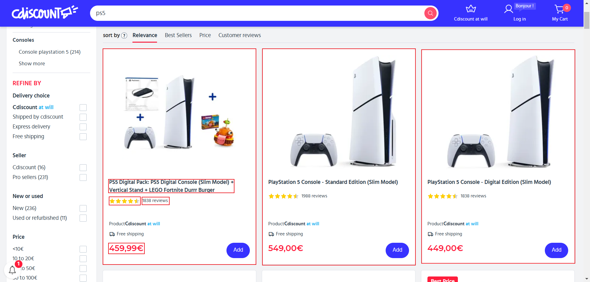
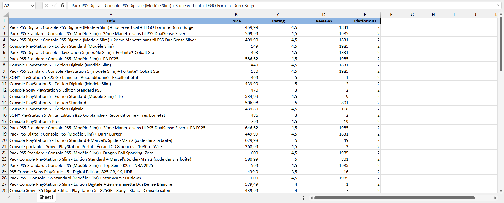
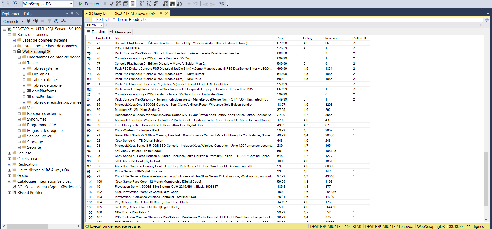

# Web Scraping CDiscount

Un projet de **web scraping** développé en **Python** pour collecter des données sur les produits de la plateforme **CDiscount**.  
Le système permet de récupérer toutes les offres pour un produit donné et de stocker les résultats à la fois dans un fichier **Excel** et dans une base de données **SQL**.

---

## 🚀 Fonctionnalités principales

🛒 **Scraping produit** :  
- Sélection d’un produit sur CDiscount  
- Collecte automatique de toutes les offres disponibles pour ce produit  

💾 **Stockage des données** :  
- Export des résultats dans un fichier **Excel** pour une analyse simple  
- Insertion des données dans une **base SQL** pour un traitement et une exploitation plus avancés  

📊 **Analyse et suivi** :  
- Comparaison des prix entre les différentes offres  
- Suivi de la disponibilité des produits et des vendeurs  

---

## 🎥 Démonstration

### 1️⃣ Capture d’écran – Produit sur CDiscount
Cette capture montre un exemple de produit choisi pour le scraping et la structure des offres collectées sur la plateforme.  

---

### 2️⃣ Capture d’écran – Table Excel
Cette capture montre la table générée dans **Excel** après le scraping :  
- Les colonnes représentent les informations collectées : nom du produit, prix, vendeur, disponibilité, etc.  

---

### 3️⃣ Capture d’écran – Base SQL
Cette capture montre la base de données **SQL** avec les données importées :  
- Les informations sont stockées de manière structurée pour un traitement ultérieur  
- Chaque ligne correspond à une offre du produit scrappé  

---

## 📂 Fichier Python
Le code source du projet est inclus dans ce repository : [`cdiscount_scraper.py`](Cdiscount_Webscraping.py).  
Ce fichier contient tout le script Python pour :  
- Scraper les produits sur CDiscount  
- Exporter les données vers Excel  
- Insérer les données dans une base SQL  

---

## 🎯 Objectif du projet
Ce projet illustre :  
- Mes compétences en **web scraping avec Python**  
- La manipulation de données et leur stockage dans **Excel** et **SQL**  
- L’automatisation complète d’un processus de collecte et d’analyse de données  

---

📧 Contact: youssefbenyahia6@gmail.com  
🌍 Portfolio : [https://youssef0612.github.io/Portfolio/](https://youssef0612.github.io/Portfolio/)
